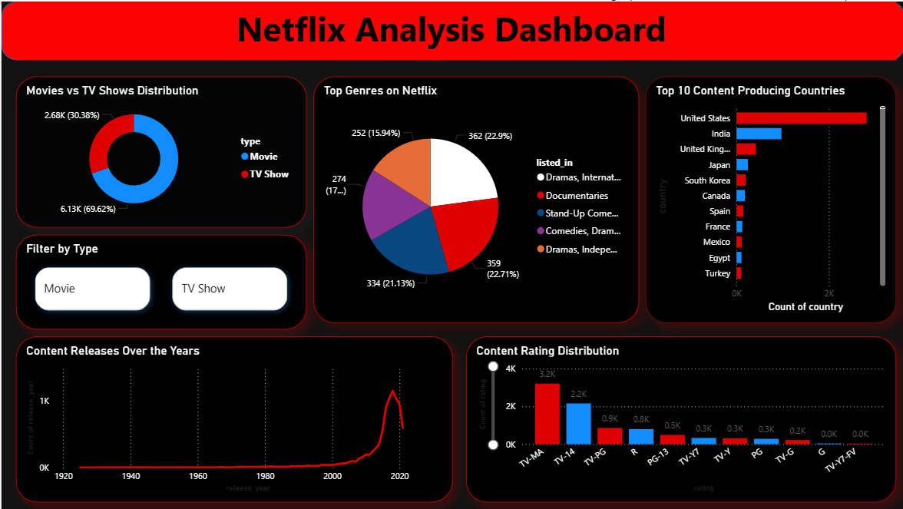

# Netflix Data Analysis Project

## Overview
This project analyzes Netflix dataset using SQL and visualizes insights using Power BI.

## Tools Used
- MySQL
- Power BI

## Key Insights
- Movies dominate over TV Shows
- Most content is produced by the United States
- Content increased rapidly after 2015
- TV-MA is the most common rating

## Dashboard

